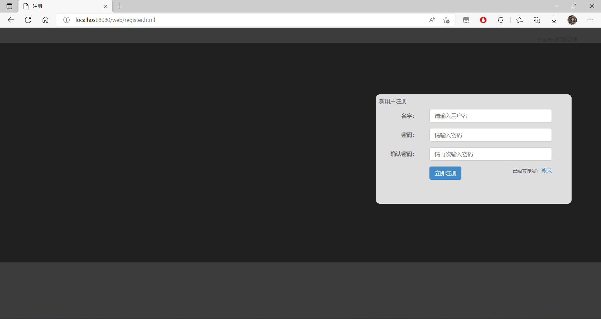
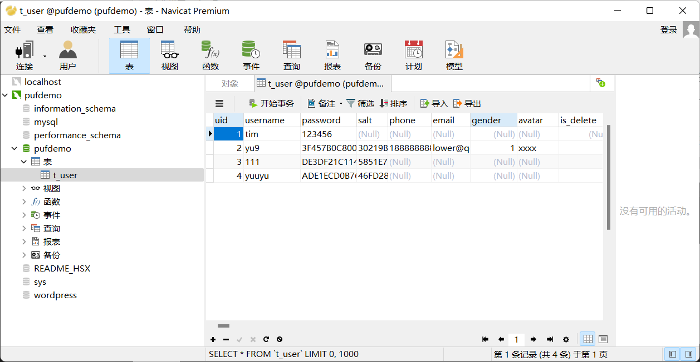
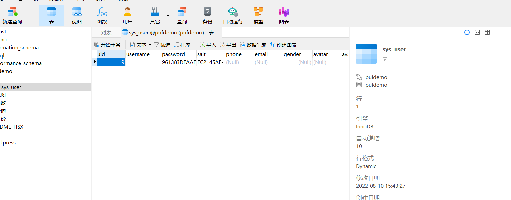
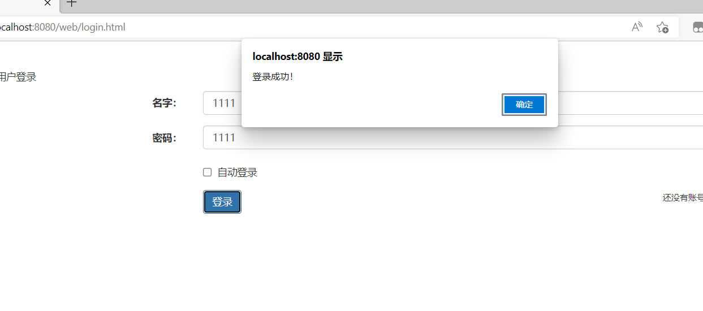

# ZY
1. 2022/07/27
上传初始化文件，配置mysql数据库，修改README文件。

2.  2022/08/11 
修改readme，上传了常用加密算法的代码

# YJL

​	1.2022/08/03

​		1.在pufdemo数据库中新建t_uer表，用于存储用户信息

​		2.搭建项目，新增controller,entity.mapper.service,util等几个模块，编写了用户实体类以及注册相关的控制服务，构建了用户注册相关的功能，并连接到数据库，在test新增UserMapperTests类，经测试成功注册到数据库表中

​		3.搭建了一个简易的前台注册页面，并使用ajax将用户信息与后台交互，经测试可以成功将数据写入数据库

2.2022/08/10

​	1.更新t_user表为sys_user表，考虑到以后可能会有权限等级，新增字段type

​	2.新增用户登录功能，经测试登录功能成功

​		测试路径：启动项目后，在浏览器打开(http://localhost:8080/web/login.html)

# ZZM
1. 2022/08/03 
学习部分JavaWeb相关课程，重新下载mysql数据库并配置；下载并安装navicat以及IDEA；
2. 2022/08/10 学习完Javaweb相关课程，跟着视频学做了一个小案例。

# NRJ
1.2022/08/10
 学习完前端基础HTML、CSS、JavaScript和AJAX 准备学习VUE
